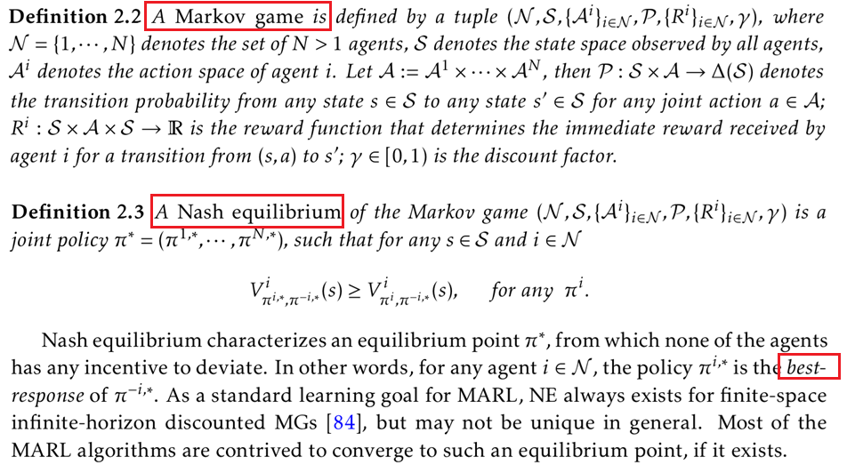
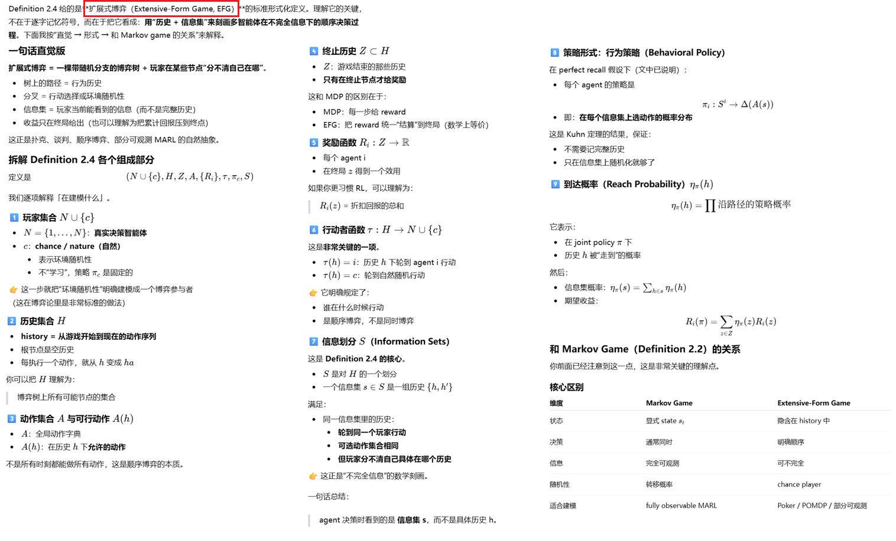
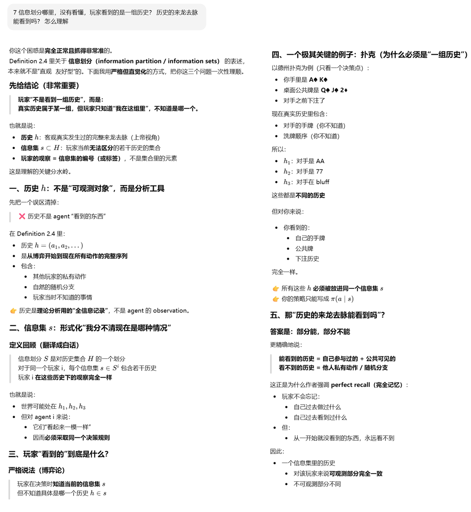

**Multi-Agent Reinforcement Learning: A Selective Overview of Theories and Algorithms**


### abstract

与现有关于多智能体强化学习（MARL）的综述正交，我们强调了MARL理论的几个新角度和分类，包括在扩展型博弈中的学习、具有网络化智能体的去中心化MARL、均值场条件下的MARL、用于博弈学习的基于策略方法的（非）收敛性等。本章的总体目标不仅是提供对多智能体强化学习领域当前状况的评估，还在于确定在MARL理论研究方面有潜力的未来研究方向。我们希望本章能继续激发对这一令人兴奋且充满挑战的话题感兴趣的研究人员的研究热情。

| **分类维度**        | **核心概念**             | **定义与工程实现重点**                                       |
| ------------------- | ------------------------ | ------------------------------------------------------------ |
| 奖励结构 (Reward)   | 零和博弈 (Zero-sum)      | 一方之得即为他方之失；重点在于极小极大化（Minimax）和自博弈（Self-play）。 |
| 奖励结构 (Reward)   | 合作场景 (Cooperative)   | 智能体共享奖励目标；重点在于信用分配（Credit Assignment），如 QMIX 算法。 |
| 奖励结构 (Reward)   | 一般项博弈 (General-sum) | 利益有冲突也有合作；目标是寻找纳什均衡；常见于社会、经济模拟。<br />最典型的例子就是囚徒困境。 |
| 时间结构 (Temporal) | 单次博弈 (One-shot)      | 博弈只进行一次；类似于矩阵博弈，不涉及状态转移。             |
| 时间结构 (Temporal) | 时序博弈 (Sequential)    | 决策随时间演进；重点在于马尔可夫决策过程（MDP）和长期收益。  |
| 行动顺序 (Move)     | 严格轮流 (Turn-taking)   | 智能体轮流行动；常用博弈树搜索和 CFR（反向悔恨最小化）算法。 |
| 行动顺序 (Move)     | 同时行动 (Simultaneous)  | 智能体同时决策；需处理联合动作空间，预判对手当前动作。       |
| 信息透明度 (Info)   | 完美信息 (Perfect Info)  | 所有人都能看到完整状态；如围棋、象棋；重点在搜索树（AlphaZero）。 |
| 信息透明度 (Info)   | 非完美信息 (Imperfect)   | 存在私有信息（如手牌）；必须用 RNN/Transformer 来建模历史记忆。 |

### 1 Introduction

大体上，根据所处理的环境类型，多智能体强化学习（MARL）算法可以分为三类：完全合作型、完全竞争型以及两者混合型。特别是，在合作环境中，代理会合作以优化共同的长期回报；而在竞争环境中，代理的回报通常总和为零。

有几个存在于MARL领域的共同的挑战：

1. MARL 中的学习目标是多维的，因为所有智能体的目标不一定一致，这带来了处理均衡点的挑战，以及一些超越回报优化的额外性能标准，例如通信/协调的效率，以及对潜在对抗智能体的鲁棒性。
2. 由于所有智能体都在根据自身利益同时改进其策略，每个智能体所面临的环境变得非平稳。这打破或使单智能体环境中大多数理论分析的基本框架失效。
3. 随着智能体数量呈指数增长的联合动作空间可能会导致可扩展性问题，这被称为多智能体强化学习的组合性质
4. 在多智能体强化学习中，信息结构，即谁知道什么，更为复杂，因为每个智能体只能有限地获取其他智能体的观测，从而可能导致局部决策规则不理想。


### 2 Background

#### 2.2 Multi-Agent RL Framework

##### 2.2.1 Markov/Stochastic Games



经典的马尔可夫博弈（Markov Game / Stochastic Game）通常假设是“全状态可观测”的；也就是说，在模型定义层面，每个 agent 都可以观测到同一个全局状态。而且在这种统一的数学模型下，agents之间的关系可以是合作（cooperative） / 对抗（competitive） / 混合（mixed, general-sum）。

| 维度                     | 马尔可夫决策过程（MDP）             | 马尔可夫博弈（Markov Game / Stochastic Game）      |
| ------------------------ | ----------------------------------- | -------------------------------------------------- |
| 决策主体                 | **单一 agent**                      | **多个 agent（(i=1,\dots,N)）**                    |
| 动作                     | 单一动作                            | 联合动作                                           |
| 状态转移                 | P(s' \| s,a)                        | P(s' \|s, 联合动作)                                |
| 奖励函数                 | 单一奖励 R(s,a,s')                  | **每个 agent 一个奖励**                            |
| 优化目标                 | 最大化单一期望回报                  | **每个 agent 最大化自己的回报**                    |
| 其他 agent               | 不存在                              | **环境的一部分，但会学习和变化**                   |
| 环境是否平稳             | ✔️ 平稳（transition 与 reward 固定） | ❌ **对单个 agent 非平稳**（他人策略在变）          |
| Bellman 方程             | 标量最优 Bellman 方程               | **耦合的 Bellman 方程 / Bellman 不等式**           |
| 解的概念                 | 最优策略                            | **Nash equilibrium（或其变体）**                   |
| 解是否唯一               | 可能唯一（常假设）                  | **通常不唯一**                                     |
| 学习难点                 | 探索–利用权衡                       | **非平稳性、协调、博弈均衡**                       |
| 单智能体 RL 是否直接适用 | ✔️                                   | ❌（除非特殊结构，如 fully cooperative / zero-sum） |
| 理论成熟度               | **高度成熟**                        | **明显落后，依赖强假设**                           |

##### 2.2.2 Extensive Form Game





### 3 Challenges in MARL Theory

#### 3.1 Non-Unique Learning Goals

**在多智能体强化学习中，“学习目标”本身往往不是唯一的，这与单智能体强化学习有本质区别。**

在单智能体强化学习中，学习目标通常是明确且唯一的，例如最大化期望累积回报，对应一个最优策略或最优价值函数。然而，在多智能体场景下，问题本质上是一个博弈。不同智能体的目标相互耦合，一个智能体的最优行为依赖于其他智能体的策略选择，因此系统中**通常不存在唯一的“最优解”**。

具体而言，多智能体系统往往存在**多个均衡解**（如多个 Nash 均衡），而这些均衡在性能、公平性或稳定性上可能彼此不同。即便所有智能体的奖励函数已经给定，学习过程仍可能收敛到不同的策略组合，而且这些结果在理论上都是合理的解。

因此，该小节强调：**多智能体强化学习面临的首要挑战之一，并不是“如何更快收敛”，而是“应该收敛到什么”**。在缺乏额外约束或协调机制的情况下，学习算法并不能保证选择某一个特定的均衡，也无法保证不同训练过程会得到一致的结果。

该小节的结论是：**由于学习目标的非唯一性，多智能体强化学习的评估和比较不能简单照搬单智能体的最优性标准，而需要明确所采用的解概念以及对均衡选择的偏好。**

#### 3.2 Non-Stationarity

在单智能体强化学习中，环境转移概率和奖励函数是固定不变的，因此可以将经验样本视为来自同一个分布，并依赖这一假设证明诸如 Q-learning 等算法的收敛性。然而，在多智能体场景下，其他智能体也在同时更新各自的策略，这意味着环境动力学会随着时间发生变化。对任一智能体而言，其观察到的状态转移和奖励分布会不断漂移，从而违反了马尔可夫性和平稳性假设。

因此，即便环境在全局层面可以被建模为一个 Markov game，只要采用的是**独立学习（independent learning）范式**，单个智能体所面对的问题就不再等价于一个标准的 MDP。这会导致经验回放失效、价值函数估计偏差累积，并使经典强化学习算法可能无法收敛，或者只能收敛到次优解。

**多智能体强化学习中的主要困难并非来自随机性本身，而是来自其他智能体策略随时间变化所引入的非平稳性**。这也是后续需要引入集中式训练、对手建模、博弈论均衡概念或信息结构假设的根本动机。

```shell
Q：FrozenLake任务里，冰面的随机滑动，这个属于环境状态转移的随机性，还是噪声？ 还是属于MARL中提到的非平稳性？ 似乎这种情况下也不能收敛。

A：FrozenLake 里冰面的随机滑动，属于环境状态转移的随机性。它不是噪声，也不属于 MARL 中讨论的那种非平稳性。

更具体地说，在 FrozenLake 中，对任意一个固定的状态 s 和动作 a，下一状态 s′ 是按照一个固定不变的概率分布来采样的。这个转移概率在整个训练过程中不会变化，也不依赖于 agent 的策略或学习进度。因此它完全满足马尔可夫决策过程对“随机转移”的定义，是 MDP 框架内部的合法随机性。

它不属于“噪声”，因为这里的随机性是被明确建模的、可重复的、统计意义上稳定的。工程上说的噪声通常指未建模或非平稳的扰动，比如传感器误差、执行误差、外界干扰等，这些会破坏 MDP 的假设，而 FrozenLake 并没有。

它也不属于 MARL 中的非平稳性。MARL 所说的非平稳性，是指对某个 agent 来说，环境的状态转移和回报分布会因为其他 agent 的策略在学习过程中不断变化而发生漂移。这种漂移是时间相关的、由学习过程本身引起的。而 FrozenLake 的转移概率是固定的，不会“随训练变”，因此不存在这种非平稳性。

至于你感觉“这种情况下也不能收敛”，这里要区分理论和实践。理论上，FrozenLake 是一个有限状态、有限动作、平稳随机转移的 MDP，Q-learning、SARSA 等算法在满足基本条件时是可以收敛的。不存在原理上的不可收敛问题。

实践中看起来“学不出来”，主要是工程层面的困难，而不是模型假设被破坏。FrozenLake 的奖励极其稀疏，随机滑动会显著放大探索的不确定性，使得价值信号传播非常慢，学习过程对随机种子高度敏感。这会让训练曲线看起来震荡、退化，甚至在有限步数内几乎没有提升，但这不等价于“理论上不能收敛”。

一句话总结：FrozenLake 的随机滑动是MDP 内的随机状态转移，不是噪声，也不是 MARL 意义上的非平稳性；它“难学”但不“不可收敛”，问题出在样本效率和奖励结构，而不是理论前提被破坏。
```


#### 3.3 Scalability Issue

在多智能体系统中，环境状态往往需要同时刻画多个智能体的状态，而动作空间通常是所有智能体动作的笛卡尔积。随着智能体数量的增加，联合状态空间和联合动作空间会呈指数级增长，这使得基于全局状态或联合动作建模的方法在存储、计算和采样效率上都变得不可行。

该小节进一步指出，即便采用集中式训练或全局 critic 来缓解非平稳性问题，也往往需要访问完整的全局状态和联合动作信息，这在大规模系统中会带来严重的通信、计算和样本复杂度负担。因此，这类方法在理论上可行，但在大规模多智能体任务中难以直接应用。

**可扩展性是多智能体强化学习的基本瓶颈之一，迫使研究者在性能最优性与计算可行性之间做权衡，并推动了参数共享、局部信息建模、分解式价值函数以及去中心化执行等方法的发展。**

#### 3.4 Various Information Structures

在许多理论分析中，往往假设所有智能体都可以观测到完整的全局状态或其他智能体的行为，但在实际应用中，这种假设通常并不成立。智能体往往只能获得局部、噪声或延迟的观测信息，甚至无法直接感知其他智能体的存在。

作者进一步区分了多种常见的信息结构，包括完全可观测、部分可观测、集中式信息与去中心化信息等情形，并指出这些差异会直接影响策略表示、学习算法设计以及可达到的性能上限。例如，在去中心化和部分可观测的条件下，单个智能体很难准确推断系统整体状态，从而使协调行为的学习变得更加困难。

多智能体强化学习中信息结构具有高度多样性，**不同的可观测性和信息共享假设会根本性地影响问题难度和算法设计**。

多智能体强化学习（MARL）中的三种典型信息结构

（a）集中式设置 (Centralized setting) 在这种结构下，系统存在一个中央控制器。该控制器可以汇总所有智能体的联合动作、联合奖励和联合观测值，并据此为所有智能体统一设计策略。智能体与控制器之间的交互主要表现为：智能体向控制器发送私有观测数据，控制器则回传为每个智能体设计的本地策略。

（b）具有网络连接的分布式设置 (Decentralized setting with networked agents) 这种结构没有中央控制器，智能体之间通过一个通信网络连接。智能体只能与自己的直接邻居进行信息交换，而本地信息正是通过这种邻居间的通信在整个网络中逐步传播的。这种设置在协作式多智能体强化学习（Cooperative MARL）中非常普遍。

（c）完全分布式设置 (Fully decentralized setting) 这是最极端的去中心化情况。系统中既没有中央控制器，智能体之间也不存在任何显式的信息交换。每个智能体完全仅凭自己的本地观测值来做出决策并更新策略。这种结构通常对应于“独立学习”（Independent Learning）方案，即每个智能体都将其他智能体视为环境的一部分。

### 4 MARL Algorithms with Theory

#### 4.1 Cooperative Setting

【同构的agents】：所有智能体拥有完全相同的奖励函数，即它们共享一个共同的目标，且通常可以观察到系统的全局状态。agent之间可互换、没有角色差异。智能体通过维护联合动作（动作的笛卡儿积）的 Q 值并学习他人的模型来达成协调 ，但这样存在扩展性问题。该情形的核心挑战在于“协调” 。即使目标一致，如果系统中存在多个最优均衡点，智能体如果不能就选择哪一个均衡达成一致（即均衡选择问题），整体表现就会受损 。

【网络化智能体下的去中心化 MARL】：智能体被部署在一个通信网络上，每个智能体只能观测到局部信息，并只能与其在网络中的邻居进行信息交换 。尽管每个智能体可能只关注自身的局部奖励，但整体目标仍然是最大化所有智能体平均奖励的综合回报 。智能体需要通过邻居间的通信（如共识协议）来弥补全局信息的缺失，从而实现在没有中心化控制器的情况下的全局协作 。这种架构具有良好的可扩展性，适用于传感器网络或大规模智能电网等现实场景 。

【分布式部分可观测马尔可夫决策过程】在 Dec-POMDPs 中，每个智能体只能通过自己的感官获取不完整的局部环境观测值，且智能体之间的通信可能受到限制或根本不存在 。由于智能体必须基于自己破碎的观测历史对整个系统的状态及他人的行为进行推理，解决该问题在数学上被证明是极其困难的 。它最贴近现实中的复杂协作任务，如多机器人搜救，强调在高度不确定性下的健壮决策 。

#### 4.2 Competitive Setting

双人零和马尔可夫博弈：两个智能体在离散的时间步中同时采取行动，状态转移和奖励由联合行动共同决定。最关键的特征是两个智能体的奖励函数完全对立，即任一时刻两者的奖励之和恒等于零

零和扩展形式博弈 ：这类博弈通常利用博弈树（Game tree）结构来建模。与侧重于状态转移的马尔可夫博弈不同，它更强调博弈的顺序性（智能体轮流行动）以及信息的非对称性。它能有效描述那些包含私有信息、无法观察到对手全部状态或动作的竞争场景。该框架下，主流的算法理论围绕反向悔恨最小化（Counterfactual Regret Minimization, CFR）展开，其核心是通过迭代减少策略的累积悔恨值来逼近纳什均衡。

#### 4.3 MixedSetting

